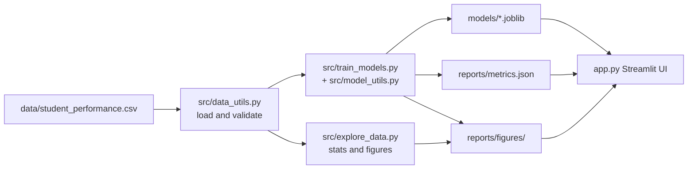

# StudySense architecture

StudySense is a small classical-ML portfolio app. Training is a separate script from the dashboard so the UI never fits models on startup.

## Data flow

## Components

| Piece | Role |
| --- | --- |
| `src/data_utils.py` | Project-relative CSV path, required columns, missing values, duplicates, numeric ranges |
| `src/explore_data.py` | Prints validation findings; writes exploration charts |
| `src/model_utils.py` | Leak-free split, sklearn pipelines, metrics, joblib save/load |
| `src/train_models.py` | CLI entry: `python src/train_models.py` |
| `app.py` | Loads saved Ridge and LogisticRegression pipelines; validates slider input; shows metrics from JSON |
| `tests/` | pytest for data checks, training artifacts, and dashboard helpers without starting Streamlit |

## Modeling notes

- Features: `study_hours`, `sleep_hours`, `attendance`, `previous_score`, `assignments_completed`, `concentration`
- Regression target: `final_score`
- Classification target: `support_needed` (1 if `final_score` was below 70 in the labeled table)
- `final_score` is excluded from `X` so the classifier cannot read the label source
- Linear models use `StandardScaler` inside a `Pipeline`; tree models do not need scaling
- Selected artifacts: `models/best_regression.joblib`, `models/best_classification.joblib`

## Runtime constraint

The project is meant to run on a CPU-only laptop (Intel Celeron, 8 GB RAM). There is no deep learning, no GPU requirement, and no external API.
